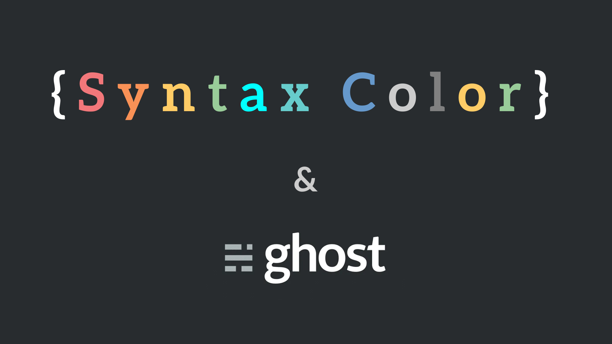

# Coloration syntaxique Ghost Blog (Prism)
Pour ajouter la coloration syntaxique, les numéros de lignes et le surlignement, vous pouvez, en utilisant l'injection de code, intégrer la bibliothèque **Prism**.

> *Prism est un surligneur syntaxique léger et extensible, construit en tenant compte des standards modernes du web. Il est utilisé dans des milliers de sites web, dont certains que vous visitez quotidiennement.*

## Injection de code
Rendez-vous dans l'espace d'administration de votre Blog, dans la rubrique *Code Injection*.

### Dans le header :
Au sein du header, vous devez ajouter la référence au CSS de Prism. Plusieurs thèmes sont disponibles (j'utilise Tomorrow).

```HTML
<!-- Prism Theme Tomorrow-->
<link rel="stylesheet" href="https://cdnjs.cloudflare.com/ajax/libs/prism/1.16.0/themes/prism-tomorrow.min.css"/>

<!-- Prism Theme Dark
<link rel="stylesheet" href="https://cdnjs.cloudflare.com/ajax/libs/prism/1.16.0/themes/prism-dark.min.css"/>-->

<!-- Prism Theme Funky
<link rel="stylesheet" href="https://cdnjs.cloudflare.com/ajax/libs/prism/1.16.0/themes/prism-funky.min.css"/>-->

<!-- Prism Theme Okaida
<link rel="stylesheet" href="https://cdnjs.cloudflare.com/ajax/libs/prism/1.16.0/themes/prism-okaida.min.css"/>-->

<!-- Prism Theme Twilight
<link rel="stylesheet" href="https://cdnjs.cloudflare.com/ajax/libs/prism/1.16.0/themes/prism-twilight.min.css"/>-->

<!-- Prism Theme Coy
<link rel="stylesheet" href="https://cdnjs.cloudflare.com/ajax/libs/prism/1.16.0/themes/prism-coy.min.css"/>-->

<!-- Prism Theme Solarized
<link rel="stylesheet" href="https://cdnjs.cloudflare.com/ajax/libs/prism/1.16.0/themes/prism-solarizedlight.min.css"/>-->
```

Pour la numérotation des lignes et le surlignement, il faut ajouter les lignes suivantes : 
```HTML
<link rel="stylesheet" href="https://cdnjs.cloudflare.com/ajax/libs/prism/1.16.0/plugins/line-numbers/prism-line-numbers.min.css"/>
<link rel="stylesheet" href="https://cdnjs.cloudflare.com/ajax/libs/prism/1.16.0/plugins/line-highlight/prism-line-highlight.min.css"/>
```

### Dans le footer : 
Dans le footer, il faut ajouter les scripts pour Prism, pour chaque langage que vous voulez supporter et pour chaques plugins utilisés.

```HTML
<!-- Core -->
<script type="text/javascript" src="https://cdnjs.cloudflare.com/ajax/libs/prism/1.16.0/prism.min.js"></script>

<!-- Line Numbers Plugin -->
<script type="text/javascript" src="https://cdnjs.cloudflare.com/ajax/libs/prism/1.6.0/plugins/line-numbers/prism-line-numbers.min.js" ></script>
<!-- Line Highlight Plugin -->
<script src="https://cdnjs.cloudflare.com/ajax/libs/prism/1.15.0/plugins/line-highlight/prism-line-highlight.js"></script>

<!-- All individual language files -->
<!-- HTML / XML syntax highlighting -->
<script src="https://cdnjs.cloudflare.com/ajax/libs/prism/1.16.0/components/prism-markup.min.js"></script>
<!-- JavaScript syntax highlighting -->
<script src="https://cdnjs.cloudflare.com/ajax/libs/prism/1.16.0/components/prism-javascript.min.js"></script>
```

## Utilisation
### Markdown
Par défaut, lorsque vous utilisez le langage markdown, la coloration est automatique pour le peu que vous ayez précisé le type de langage lors de l'insertion d'un bloc de code. Cependant, via cette méthode, la numérotation des lignes et le surlignement ne fonctionne pas.

### HTML
Il faut donc ajouter, dans votre article, un bloc HTML contenant cette base :
```
<pre class="line-numbers language-javascript" data-line="1-1">
    <code>
    // ajouter du code ici
    </code>
</pre>
```

<pre class="line-numbers language-javascript" data-line="2-2"><code>// Exemple de code JavaScript
console.log("Hello World");
</code></pre>

## Ressources : 
- https://prismjs.com/index.html
- https://www.coengoedegebure.com/syntax-coloring-and-line-numbers-in-ghost/
- https://cdnjs.com/libraries/prism